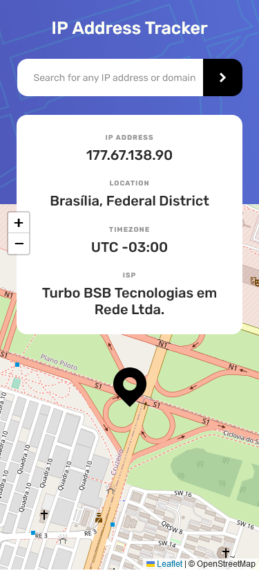
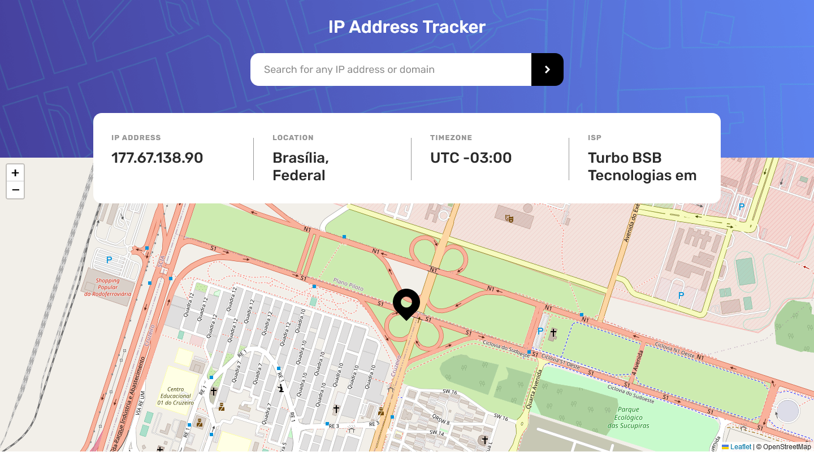

# Frontend Mentor - IP address tracker solution

This is a solution to the [IP address tracker challenge on Frontend Mentor](https://www.frontendmentor.io/challenges/ip-address-tracker-I8-0yYAH0). Frontend Mentor challenges help you improve your coding skills by building realistic projects. 

## Table of contents

- [Overview](#overview)
  - [The challenge](#the-challenge)
  - [Screenshot](#screenshot)
  - [Links](#links)
- [My process](#my-process)
  - [Built with](#built-with)
- [Author](#author)

## Overview

### The challenge

Users should be able to:

- [X] View the optimal layout for each page depending on their device's screen size
- [X] See hover states for all interactive elements on the page
- [X] See their own IP address on the map on the initial page load
- [X] Search for any IP addresses or domains and see the key information and location

### Screenshot

#### Result Mobile

#### Result Desktop

### Links

- Solution URL: [Add solution URL here](https://your-solution-url.com)
- Live Site URL: [Add live site URL here](https://your-live-site-url.com)

## My process

### Built with

- Semantic HTML5 markup
- CSS custom properties
- Flexbox
- Mobile-first workflow
- Responsive Web Design(RWD)
- JavaScript Programming Language
- API DOM Native JS
- API FETCH Native JS
- API Geolocation IPify / Para obter localizações do endereço IP - [API IPify](https://geo.ipify.org/)
- API LeafletJS / Para gerar o mapa - [API LeafletJS](https://leafletjs.com/)
- Normalize CSS - [Normalize](https://necolas.github.io/normalize.css/) - Reset CSS
- Methodology BEM(Block Element Modifier) - [BEM](http://getbem.com/introduction/) - Methodology

## Author

- Website - [Portefólio Samuel Amaro](https://samuel-amaro.github.io/portefolio-website/)
- Frontend Mentor - [@Samuel-Amaro](https://www.frontendmentor.io/profile/Samuel-Amaro)